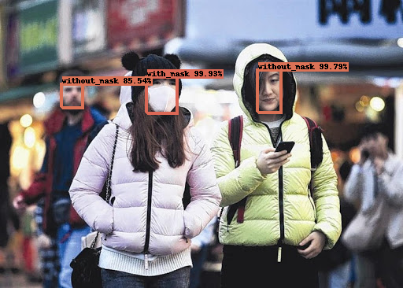
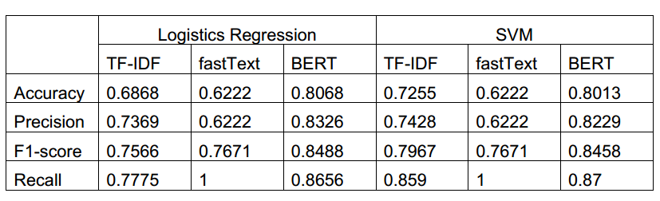
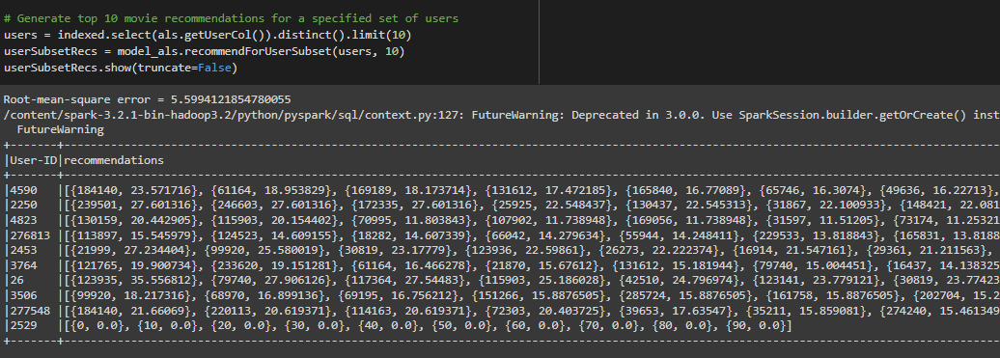
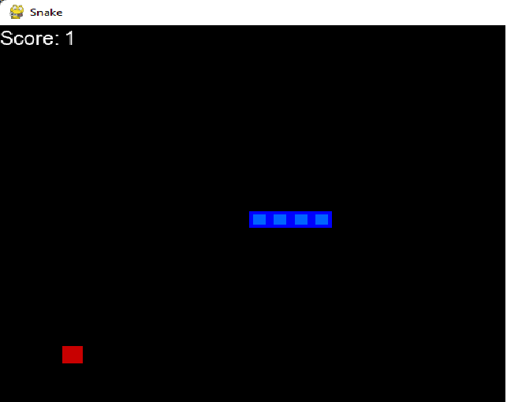

## I know that I don't know anything
<html>
<head>
  
</head>
<body>

  <im style="float: left; margin-right 1em;">
    
  </im>
  

    
Hi, I'm Tran Duc Phu, a Graduated Student of the Ho Chi Minh University of Science majoring in computer science. I may have very little working experience in this industry, just about 1.5 years but I'm always curious and eager to learn new things. Especially in the field of data analysis and data science. I'm fascinated with all the things that we can do when we have those data in our hands. Like Albert Einstein used to say "I am neither clever nor especially gifted. I'm just very, very curious"
 
  

</body>
</html>

## Contact: <a href="https://github.com/TranPhu1999">Github</a>  <a href="https://www.linkedin.com/in/tran-duc-phu-505841192/">LinkedIn</a> <a>phu1091999@gmail.com</a>

### EXPERIENCE: 
6 month of Data Analyst, 6 month of Data Scientist

<b> FPT Telecom: Data Analyst Intern</b>
- Working with the advertising team and data engineer team to write SQL/ClickHouse queries to get data, then make visualization and reports from those datasets.

<b> FADO (CROSS-BORDER E-COMMERCE): Data scientist intern</b>
- Working with 5 other members of the data science team to research and implement technologies for Recommendation System, Customer Data Platform
- Label data, write image augmentation function and train machine learning model for ID card information extraction

### SKILLS:
<b> Programming Language: </b>
- Python, C/C++, SQL, ClickHouse, HTML, CSS, Javascript

<b> Data Science Knowledge:</b>
- Spark, MongoDB, Python, Library(Selenium, Numpy, Pandas, Matplotlib, Plotly, Scikit-learn, Tensorflow)
- Familiar with tools like Redash, PowerBI, Github, Docker,...
- Have a basic knowledge of Google Cloud Services, Recommendation System, Clustering, Dimension Reduction, ETL

# Project: [YOLO_face_mask_detection](https://github.com/TranPhu1999/YOLO_face_mask_detection)
In this project: Tensorflow, OpenCV, Numpy, flask, HTML, CSS, JavaSript
- Train a Yolov3 model to detect Face mask wearing with Kaggle Face Mask Dataset
- Build a Flask API that receive image send it to one of the two Yolov3 models (first one is pretrained model on COCO dataset, the second one is the model that I just train above) as input and send image result to a web interface 
- Build a simple web interface that Upload image from user then send it to Flask API, receive and display the output 

| | |

# Project: [Explore and predict Vietnam weather](https://github.com/TranPhu1999/Explore_Predict_Vietnam-weather)
In this project: request, pandas, numpy,  matplotlib, seaborn, Sklearn
- Write code to call API and request data about Vietnam weather from openweathermap.org 
- Explore and preprocess data: check null, check duplicate, check data distribution, reformat data for modeling 
- Build LogisticRegression Classifier and Naive Bayes Classifier to try to predict the weather after 12h from the current time 

# Project: [Sentiment_analysis](https://github.com/TranPhu1999/Sentiment_analysis)
In this project: Selenium, pandas, Sklearn, pymongo, embedding methods
- Crawl Airpod review data from Amazon 
- Manualy label review sentence as Positive and Negative, remove spelling mistake, typos,... 
- Using TF-IDF, BERT and fastText to create embeddings for each sentences
- Store data on MongoDB cloud
- Connect to MongoDB, extract data and use logistic regression and Support Vector Machine to build classification model

# Project: [Simple_recommendation_system](https://github.com/TranPhu1999/Simple_recommendation_system)
In this project: numpy, findspark, PySpark, pandas, Recommendation System metrics
- Download book-crossing and movieLens dataset for trainning recommendation system
- Using PySpark to train a ALS recommendation system
- Evaluate trained recommendation system base on 3 metrics: HitRate, Root mean square error, Normalized Discounted Cumulative Gain

# Project: [Snake_game_AI_for_kid](https://github.com/TranPhu1999/Snake_reinforcement_learning)
In this project: torch, pygame, numpy, matplotlib
- Create a simple Snake Game with pygame
- Train a Reinforcement learning model to play the automatically

