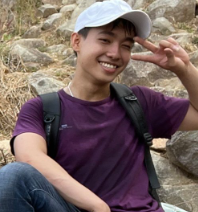

## I know that I don't know anything
<html>
<head>
  
</head>
<body>

  <im style="float: left; margin-right 1em;">
    
  </im>
  

    
Hi, I'm Tran Duc Phu, a graduate student at the Ho Chi Minh University of Science majoring in computer science. With just 3 years of experience, I know I must always stay humble because there are still so many things to learn. What I'm looking for right now is a chance to bring value to AI-driven businesses or if convenient, a friend, a mentor, a good chance to learn and experience new things, especially in the field of data analysis and data science. 
 
  

</body>
</html>

## Contact: <a href="https://github.com/TranPhu1999">Github</a>  <a href="https://www.linkedin.com/in/tran-duc-phu-505841192/">LinkedIn</a> <a>phu1091999@gmail.com</a>

# 2.5 YEARS OF EXPERIENCES

<b> FPT Telecom: Data Analyst Intern (1 year)</b>
- Continuously working with Marketing team to get requests for what metrics and advertising campaigns need to be tracked across days, months, and quarters.
- Assist Data Engineer team in writing SQL/ClickHouse queries and use Redash or PowerBI to build various dashboards and interactive visualizations for Marketing team to monitor FPT Play Advertising Campaigns.

<b> FADO (CROSS-BORDER E-COMMERCE): Data scientist (6 months)</b>
- Working with 5 other members of the Data Science team to research and make presentations about frameworks and technologies for Recommendation System, Customer Data Platform, and eKYC.
- Collect, label, clean raw data, and write image augmentation and preprocess functions using NumPy and OpenCV2
- Train, evaluate, and deploy models into production.
- Research and build a customer behavior prediction based on Fingerprint
- Using various techniques: CNN, YOLOv5, VIETOCR to build a pipeline for extract information from customers citizen ID

<b> GTechHCM: AI Engineer (1 year)</b>
- Utilizing OKR framework, collaborating with PM and BA to understand the customer requirements, and building on-premise projects
- Build a Contents Understanding System that can assist various NLP and CV tasks like summarizing, translating, classifying topics, recognizing entities in documents; detecting, recognizing objects and finding similar objects in images.
- Collecting and cleaning data, applying feature engineering and data transformation to enhance data quality or even creating synthetic data if necessary. 
- Select appropriate AI, ML algorithms. Train, evaluate, and deploy models into production.
- Monitoring, and maintaining AI services
- Optimizing and successfully increase a language model performance and accuracy by 90%.

### SKILLS:
<b> Programming Language: </b>
- Python, C/C++, SQL, ClickHouse, HTML, CSS, Javascript

<b> Data Science Knowledge:</b>
- Machine Learning Algorithms like SVM, Logistic Regression, Linear Regression,... Computer Vision, Natural Language Processing, Large Language Models, Video/Sound processing.
- Spark, Python, Scikit-learn, Tensorflow, Transformers
- Familiar with tools like Redash, PowerBI, Github, Docker,...
- Have experience with on-premise projects and have basic skills of cloud platforms: Google Cloud Services
- Experience with model optimization techniques like model Distillation, Half-precision calculation, Smart batch processing,...
- Experience with Linux command prompt

# Project: [YOLO_face_mask_detection](https://github.com/TranPhu1999/YOLO_face_mask_detection)
In this project: Tensorflow, OpenCV, Numpy, flask, HTML, CSS, JavaSript
- Train a Yolov3 model to detect Face mask wearing with Kaggle Face Mask Dataset
- Build a Flask API that receive image send it to one of the two Yolov3 models (first one is pretrained model on COCO dataset, the second one is the model that I just train above) as input and send image result to a web interface 
- Build a simple web interface that Upload image from user then send it to Flask API, receive and display the output 

| | |

# Project: [Explore and predict Vietnam weather](https://github.com/TranPhu1999/Explore_Predict_Vietnam-weather)
In this project: request, pandas, numpy,  matplotlib, seaborn, Sklearn
- Write code to call API and request data about Vietnam weather from openweathermap.org 
- Explore and preprocess data: check null, check duplicate, check data distribution, reformat data for modeling 
- Build LogisticRegression Classifier and Naive Bayes Classifier to try to predict the weather after 12h from the current time 

# Project: [Sentiment_analysis](https://github.com/TranPhu1999/Sentiment_analysis)
In this project: Selenium, pandas, Sklearn, pymongo, embedding methods
- Crawl Airpod review data from Amazon 
- Manualy label review sentence as Positive and Negative, remove spelling mistake, typos,... 
- Using TF-IDF, BERT and fastText to create embeddings for each sentences
- Store data on MongoDB cloud
- Connect to MongoDB, extract data and use logistic regression and Support Vector Machine to build classification model

# Project: [Simple_recommendation_system](https://github.com/TranPhu1999/Simple_recommendation_system)
In this project: numpy, findspark, PySpark, pandas, Recommendation System metrics
- Download book-crossing and movieLens dataset for trainning recommendation system
- Using PySpark to train a ALS recommendation system
- Evaluate trained recommendation system base on 3 metrics: HitRate, Root mean square error, Normalized Discounted Cumulative Gain

# Project: [Snake_game_AI_for_kid](https://github.com/TranPhu1999/Snake_reinforcement_learning)
In this project: torch, pygame, numpy, matplotlib
- Create a simple Snake Game with pygame
- Train a Reinforcement learning model to play the automatically

